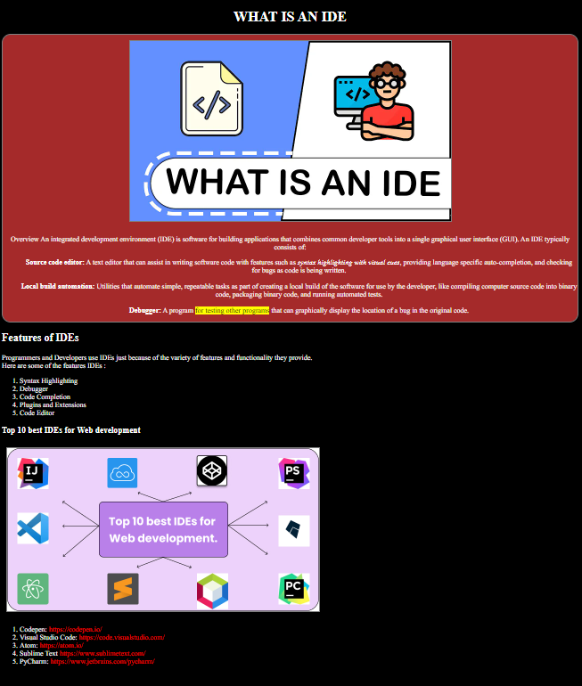

# SALESFORCE-ASSIGNMENT
This project will seem like this page;

(https://hellenkuttery.github.io/saleforce-ass/)

## For styling;link 
- Use borders for pictures;
- Give a background color to the first part.
- Change text color, link colors.
- Eliminate the underlines of links and styles of list.

## The raw text of this page;

Overview An integrated development environment (IDE) is software for building applications that combines common developer tools into a single graphical user interface (GUI). An IDE typically consists of:
Source code editor: A text editor that can assist in writing software code with features such as syntax highlighting with visual cues, providing language specific auto-completion, and checking for bugs as code is being written.

Local build automation: Utilities that automate simple, repeatable tasks as part of creating a local build of the software for use by the developer, like compiling computer source code into binary code, packaging binary code, and running automated tests.

Debugger: A program for testing other programs that can graphically display the location of a bug in the original code.
Features of IDEs
Programmers and Developers use IDEs just because of the variety of features and functionality they provide.
Here are some of the features IDEs :

Syntax Highlighting
Debugger
Code Completion
Plugins and Extensions
Code Editor
Top 10 best IDEs for Web development

- Codepen: https://codepen.io/
- Visual Studio Code: https://code.visualstudio.com/
- Atom: https://atom.io/
- Sublime Text https://www.sublimetext.com/
- PyCharm: https://www.jetbrains.com/pycharm/
--- 
## The links for pictures:
- https://i.ytimg.com/vi/GID5Ul44-kE/hq720.jpg?sqp=-oaymwEcCNAFEJQDSFXyq4qpAw4IARUAAIhCGAFwAcABBg==&rs=AOn4CLA5m9hysiaZiXq_e3WtymHT6Mv7EQ
- https://studyber.com/wp-content/uploads/2021/04/Frame-6.jpg
---
## The links for list items(links):

1. https://codepen.io/trending
2.  https://code.visualstudio.com/
3. https://atom.io/
4. https://www.sublimetext.com/
5. https://www.jetbrains.com/pycharm/
----

